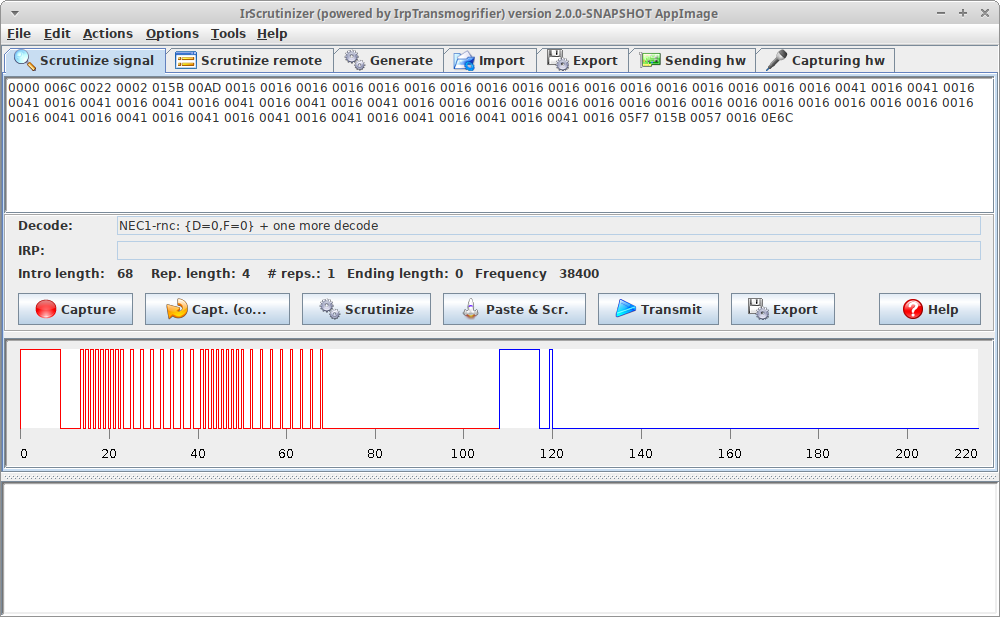

# IrScrutinizer 
IrScrutinizer is a powerful program for capturing, generating,
analyzing, importing, and exporting of infrared (IR) signals.

Author: Bengt Martensson.
See also the [project home page](http://www.harctoolbox.org).

## Copyright and License

Copyright (c) Bengt Martenson 2010-2020.
Licensed under the [GPL version 3](http://www.gnu.org/licenses/gpl.html) license or later.
Some contained third-party components have different, but compatible, licenses. This is documented elsewhere.

## Repository

The GitHub repository was previously named `harctoolboxbundle`, but has been renamed to `IrScrutinizer`.

## Documentation
The reference manual is included in the distributions.
It can be read online [here](http://www.harctoolbox.org/IrScrutinizer.html).

A tutorial can be found [here](http://www.hifi-remote.com/wiki/index.php?title=IrScrutinizer_Guide).

API documentation is found [here](https://bengtmartensson.github.io/IrScrutinizer/)
(current version only).

## Installation

Installation from sources, including installation of the dependencies, is covered in detail in the
appendix of the manual `IrScutinizer.html`,
also available directly as [BUILD.md](https://github.com/bengtmartensson/IrScrutinizer/blob/master/BUILD.md).

## Roadmap

A roadmap for the future development is available [in the ROADMAP](ROADMAP.md).

## Want to help?

All sort contributions are welcome. Bug reports and suggested improvements go to the
[issues](https://github.com/bengtmartensson/IrScrutinizer/issues). There,
also [issues marked "Help wanted"](https://github.com/bengtmartensson/IrScrutinizer/issues?q=is%3Aopen+is%3Aissue+label%3A%22help+wanted%22)
can be found.

Coding guidelines are found [here](CONTRIBUTING.md).

## Support

No official support forum exists. Therefore, support questions (not just suggestions and bug reports)
posted as [isssues](https://github.com/bengtmartensson/IrScrutinizer/issues) are welcome.

I also participate in the [JP1 forum](http://www.hifi-remote.com/forums/), see e.g.
[this thread](http://www.hifi-remote.com/forums/viewtopic.php?t=14986)) and
[Remote Central](http://www.remotecentral.com/cgi-bin/mboard/forums.cgi) and will answer questions there.